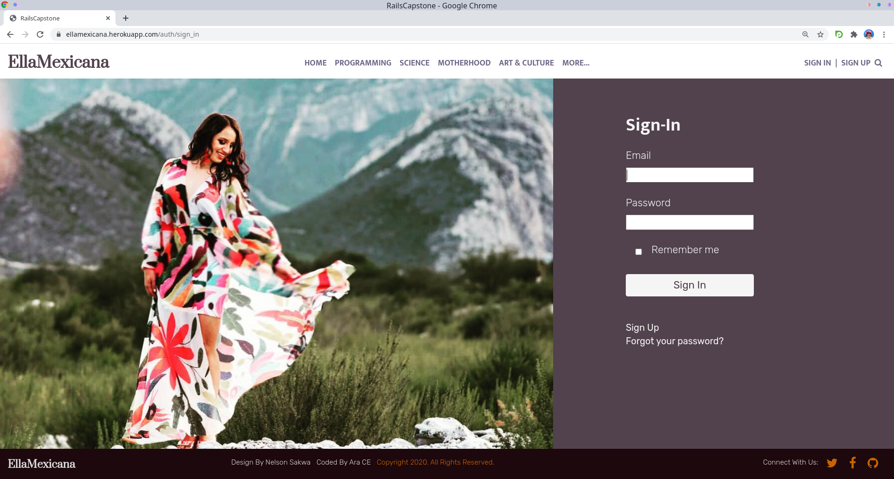
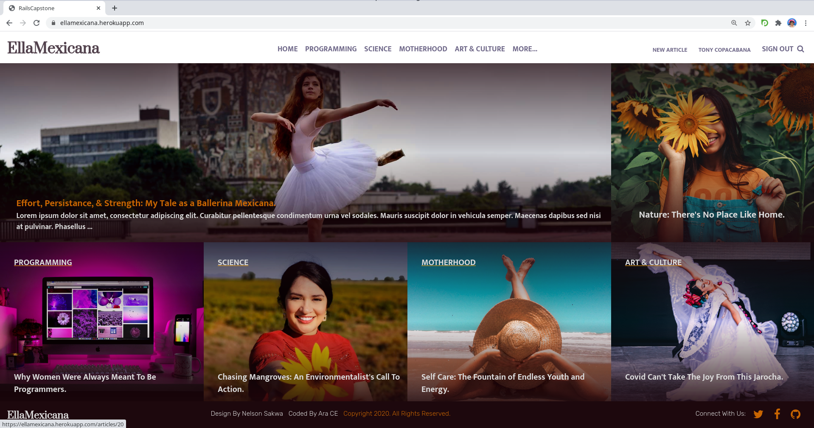
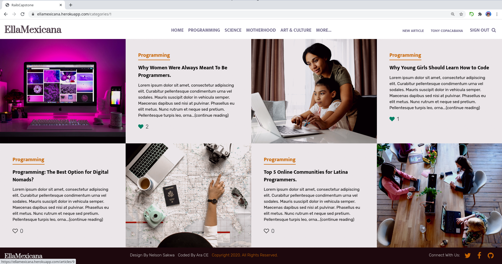
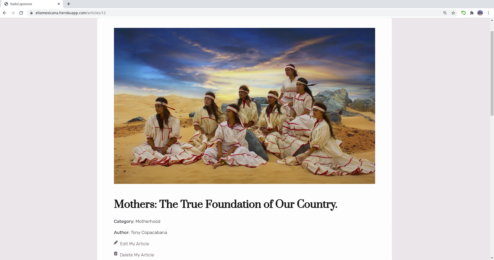

<p align="center"></p>

# Ruby on Rails Capstone: EllaMexicana Magazine
This is my Rails Capstone Project-Articles: EllaMexicana is an online Magazine that Empowers, Celebrates and Uplifts Mexican women specially those in the Technology and Science fields.

<!-- TABLE OF CONTENTS -->
## Table of Contents
- [Ruby on Rails Capstone: EllaMexicana Magazine](#ruby-on-rails-capstone-ellamexicana-magazine)
  - [Table of Contents](#table-of-contents)
- [About The Project](#about-the-project)
  - [🌟 Check Out the Live Version Here! 🌟](#-check-out-the-live-version-here-)
  - [👀 Sneak Peek Of The WebSite!](#-sneak-peek-of-the-website)
  - [Project Extra Feature](#project-extra-feature)
  - [N + 1](#n--1)
- [Getting started](#getting-started)
  - [Installation](#installation)
  - [Usage:](#usage)
  - [Run tests:](#run-tests)
  - [Features:](#features)
  - [Ruby Gems used in this project](#ruby-gems-used-in-this-project)
- [Author](#author)
- [Acknowledgements](#acknowledgements)
    - [Design Layout](#design-layout)
    - [Content Development](#content-development)
    - [Images](#images)
- [🤝 Contributing](#-contributing)
- [Show your support](#show-your-support)
- [📝 License](#-license)
<!-- ABOUT THE PROJECT -->
# About The Project
This is my Rails Capstone Project-Articles: EllaMexicana is an online Magazine that Empowers, Celebrates and Uplifts Mexican women specially those in the Technology and Science fields.
This project demonstrates a User Role system giving the web application and native application feel all within the browser. I used Rails generators to help scaffold views. The app features the CRUD principle for Categories, Users, & Articles. You can also vote for your favorite article.

The Seed File inside the database contains the Main 5 Categories showcased in this project, along with 3 Users that can be used to peruse the site and create your own categories and articles. You can still create your own user, password, articles and categories, I just added these for easier accesability.

## 🌟 Check Out the Live Version Here! 🌟

[EllaMexicana: Empower, Celebrate, and Elevate Mexican Women](https://ellamexicana.herokuapp.com/)
[Explanation Video Link Here](https://www.loom.com/share/3a4229ba3c9a425ab004c9762700595c)

## 👀 Sneak Peek Of The WebSite!
<details>
<summary>Click Here:</summary>




</details>


## Project Extra Feature
Devise is used to enhance User Sign In/Up and Authentication during User Creation and is the extra feature of this project. It was named as 'Auth' in the routes to avoid confusion in between authentication and user.

## N + 1
The N + 1 queries were solved with the help of the Bullet Gem, which shows a warning whenever there is a problem with eager loading and N + 1. I then created scopes to solve this for:
- The Most Voted Article.
- The Articles in the bottom of Article Index.
- The Category Show.

<!-- GETTING STARTED -->
# Getting started
## Installation
* Clone the repo with [this repo link](https://github.com/aracelicaes/rails_capstone)
* Install all dependencies running from terminal using the command <pre><code>bundle install
</code></pre>
* 🔔 Set up Database <pre><code>rails db:create <br>rails db:migrate <br>rails db:seed</code></pre>

## Usage:

Start server with:

```
    rails server
```

Open `http://localhost:3000/` in your browser.

## Run tests:

```
    rpsec
```

## Features:
* Ruby 2.7.0
* Rubocop
* Ruby Gems
* Postgresql
* Rspec
* Capybara
* Heroku
* AWS S3
* Font Awesome
* Google Fonts
* Bootstrap

## Ruby Gems used in this project

* [Bootstrap](https://getbootstrap.com/) - SCSS Framework.
* [Font-Awesome](https://fontawesome.com/) - For SASS icons.
* [Capybara](https://rubygems.org/gems/capybara) - For Testing.
* [Shoulda Matchers](https://rubygems.org/gems/shoulda-matchers) - For Simpler Rspec Testing.
* [SimpleCov](https://rubygems.org/gems/simplecov) - For Testing Coverage.
* [Minimagick](https://rubygems.org/gems/mini_magick) - For Image Upload Verification via Active Storage.
* [Devise](https://rubygems.org/gems/devise) - For User Sign Up/In Authentication.
* [Bullet](https://rubygems.org/gems/bullet) - For Solving N+1 Queries.

<!-- CONTACT -->
# Author
👤 **Ara Camarillo**

- Github: [aracelicaes](https://github.com/aracelicaes)
- Twitter: [@Ara_CE_93](https://twitter.com/Ara_CE_93)
- Linkedin: [Ara Camarillo](www.linkedin.com/in/ara-camarillo)

📄 **Project Link: [Click Here](https://github.com/aracelicaes/rails_capstone)**

<!-- ACKNOWLEDGEMENTS -->
# Acknowledgements

### Design Layout
[Design Idea By Nelson Sakwa](https://www.behance.net/gallery/14554909/liFEsTlye-Mobile-version)

### Content Development
- [Microverse](https://microverse.org)
- [Best-README-Template](https://github.com/othneildrew/Best-README-Template)
- [Rails Guides](https://guides.rubyonrails.org/)
- [Ruby on Rails: Customize the devise user (Screencast #1)](https://www.youtube.com/watch?v=5inpxIHKhkE)
- [GoRails](https://gorails.com)
- [RubyGems](https://rubygems.org)
- [StackOverflow](https://stackoverflow.com/)

### Images
- [Pexels Images](https://www.pexels.com/collections/em-h2wbchq/)
- [@dercess](https://www.instagram.com/dercess/)
- [@quetzallim](https://www.instagram.com/quetzallim/)
- [@missmariant](https://www.instagram.com/missmariant/)
- [@aldomc.photo](https://www.instagram.com/aldomc.photo/)
- [@hugo.penasco](https://www.instagram.com/hugo.penasco/)
- [@raycardieg](https://www.instagram.com/raycardieg/)

# 🤝 Contributing

Contributions, issues and feature requests are welcome!

- Feel free to check the [issues page](issues/https://github.com/aracelicaes/rails_capstone/issues)
- Or Email Me at: [Ara's Gmail](arace0393@gmail.com)

# Show your support

Give a ⭐️ if you like this project!

# 📝 License

⚖️ MIT LICENSE
